# 🔥 VibeOut: Workouts That Feel You 🔥

<p align="center">
  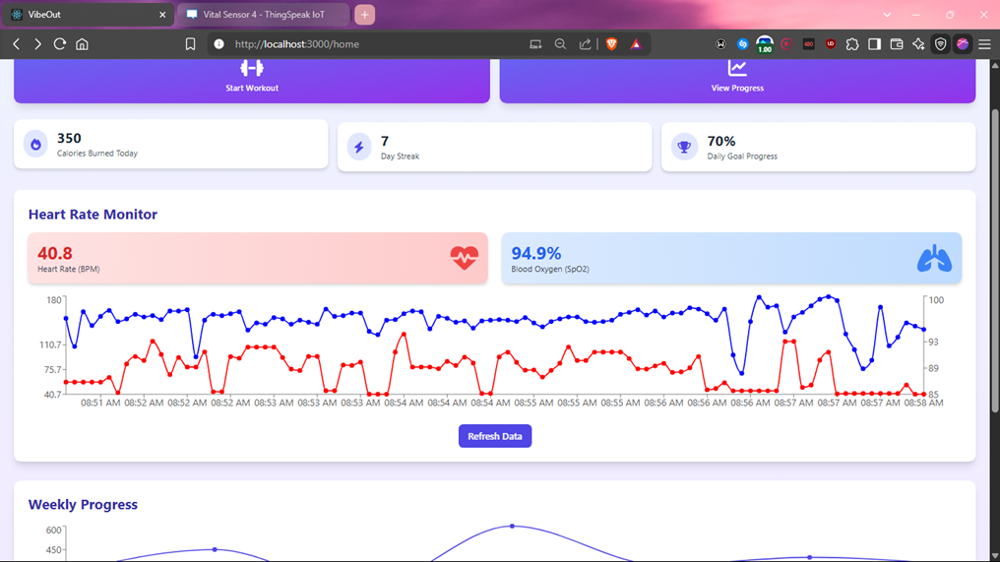
</p>

> ## 📱 **A real-time emotion-aware fitness platform that syncs your mind and body.**

## 💡 Concept

VibeOut is not just another fitness app—it's your **emotional fitness companion**. Traditional apps focus solely on physical metrics like steps and calories, but VibeOut adds the critical missing layer: **emotional intelligence** combined with **IoT-powered biometrics**.

By integrating cutting-edge AI-driven emotion recognition with IoT-based vitals monitoring, VibeOut creates a genuinely personalized wellness experience that adapts to how you actually feel during workouts.

<p align="center">
  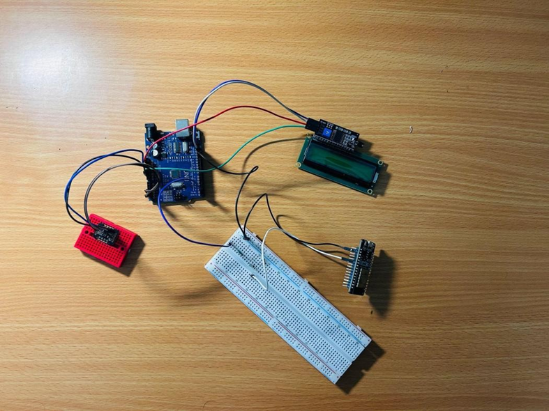
</p>

## 🏗️ Architecture Overview

<p align="center">
  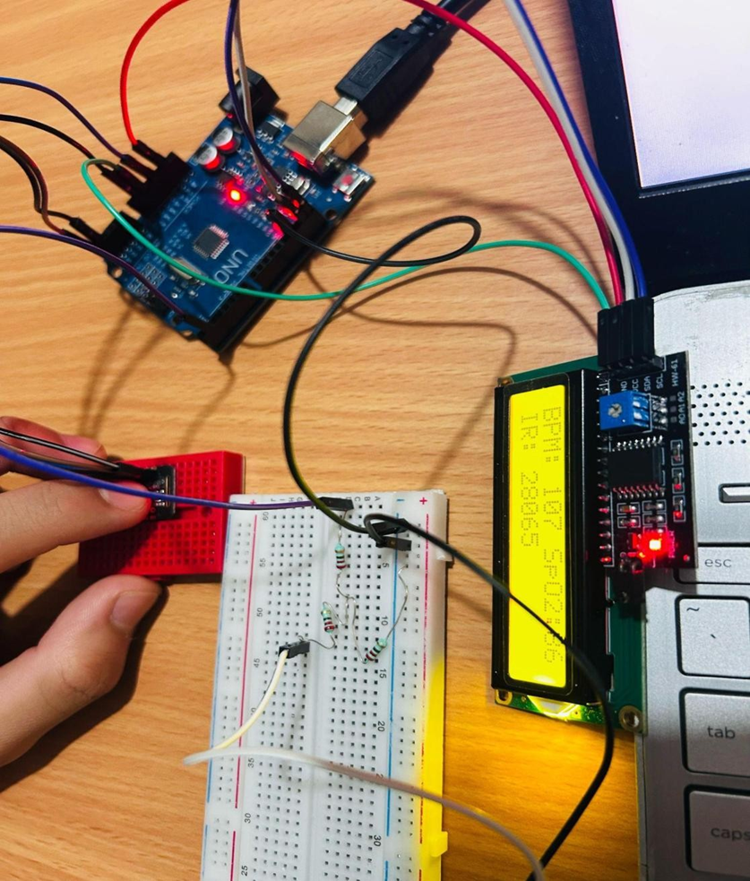
</p>

Our architecture integrates emotion detection AI with ESP32-based IoT sensors to create a full-stack wellness solution:

1. **IoT Layer**: ESP32 with MAX30102 sensor captures real-time heart rate and SpO2 data
2. **Backend**: FastAPI server processes sensor data and AI analysis
3. **Frontend**: React-based UI visualizes biometrics and emotional states
4. **AI Models**: Analyzes facial expressions and voice tones for emotional context

## 🔍 The Problem We're Solving

- 😓 Traditional fitness platforms ignore emotional states, leading to burnout and inconsistent results
- 📉 67% of users cite lack of motivation; over 50% abandon fitness programs within 6 months
- ❤️ Intense workouts without proper monitoring can lead to dangerous heart strain
- 🧠 Emotional well-being is essential for long-term fitness success—yet completely overlooked!

## ✨ Key Features

### 1️⃣ Emotion-Driven AI
- Facial emotion recognition through advanced CNN
- Voice emotion analysis via sophisticated LSTM
- Real-time data capture through device camera and microphone

### 2️⃣ IoT-Based Vitals Detection
- Heart rate and SpO2 monitoring via MAX30102 sensor + ESP32
- Real-time visual feedback through integrated OLED display
- Data streaming to ThingSpeak IoT platform for advanced analytics

<p align="center">
  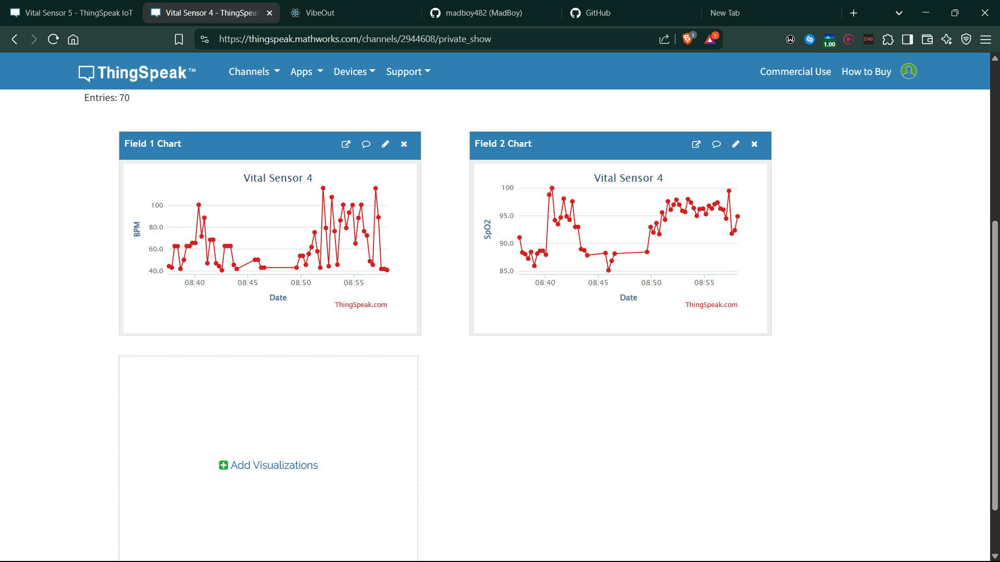
</p>

### 3️⃣ Adaptive Workout Engine
- Smart workout recommendations based on emotional and physical state
- Prevents overexertion by alerting users to dangerous vital spikes
- Personalized exercise plans adapting to real-time biometrics

### 4️⃣ Context Awareness
- Adjusts for time of day, ambient conditions, and your circadian rhythm
- Correlates emotional states with physical performance metrics
- Creates a holistic wellness profile updated in real-time

## 🛠️ Tech Stack

- **Frontend**: React + Tailwind CSS
- **Backend**: FastAPI (Python)
- **AI Models**:
  - Google Gemini API for video analysis
  - CNN (facial), LSTM (voice) models
  - Face-api.js for real-time emotion detection
- **IoT**:
  - ESP32 microcontroller
  - MAX30102 sensor (Heart rate & SpO2)
  - ThingSpeak IoT platform
- **APIs**: REST, Serial communication for IoT synchronization
- **Development**: VS Code, Arduino IDE

<p align="center">
  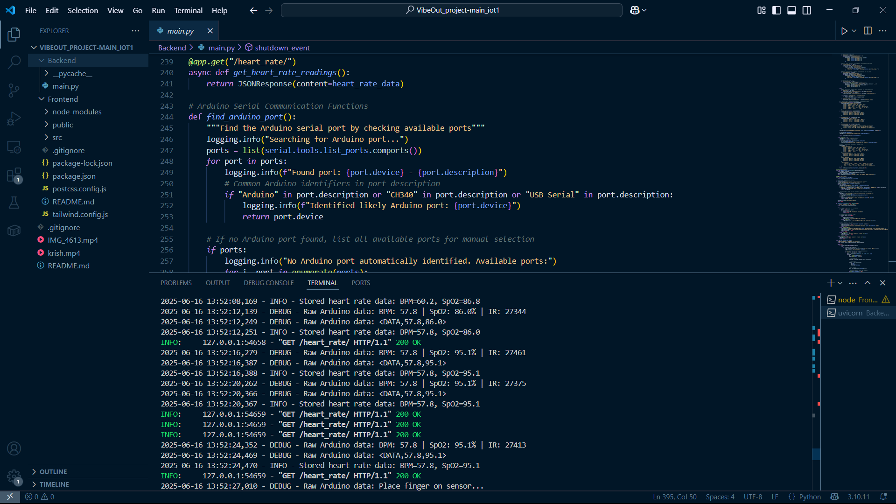
</p>

## 📱 App Showcase

<p align="center">
  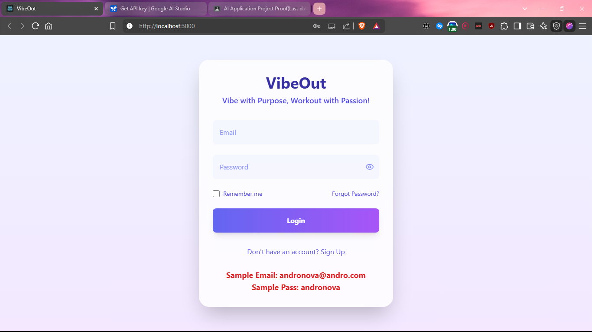
  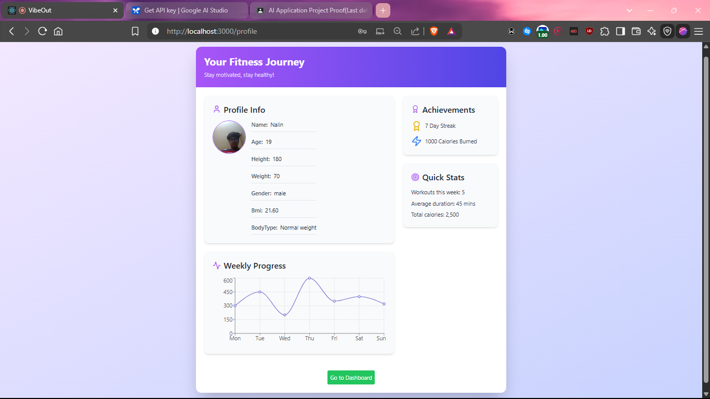
  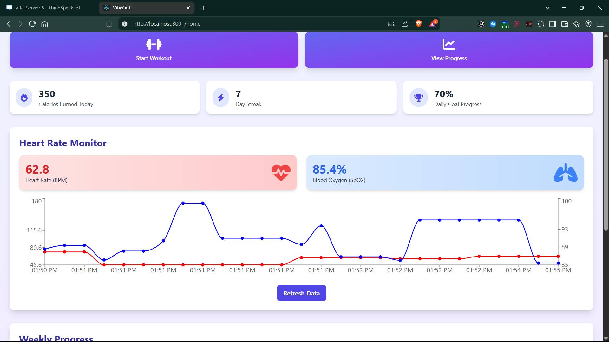
</p>

<p align="center">
  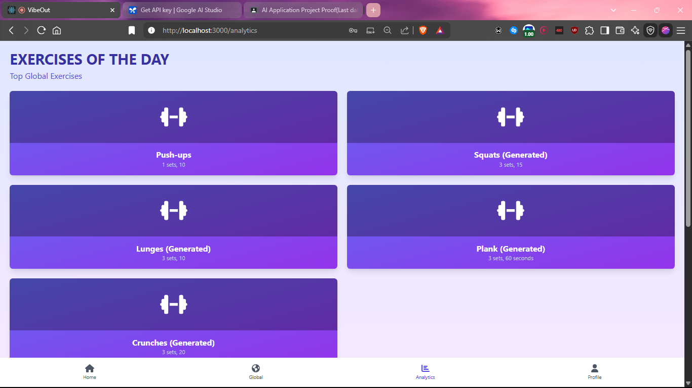
  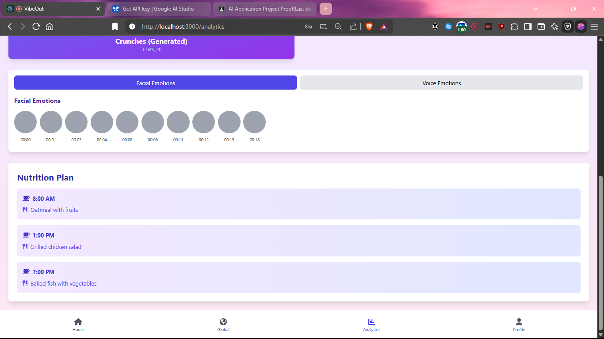
  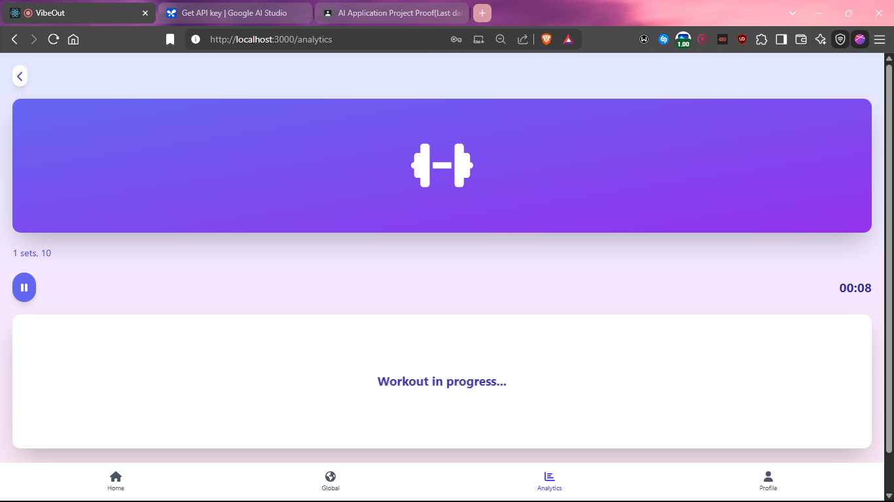
</p>

## 📊 IoT Dashboard: Real-Time Health Monitoring

The heart of our innovation is the IoT integration that provides real-time health metrics:

- **Heart Rate Monitoring**: Track BPM variations during different workout intensities
- **Blood Oxygen**: Ensure safe SpO2 levels during high-intensity exercises
- **Real-Time Graphing**: Visualize vitals over time to identify patterns and trends

<p align="center">
  
</p>

## 🌟 Impact & Future Scope

- Bridges the emotional gap in traditional fitness routines
- Improves user retention and workout safety through IoT integration
- Promotes mental wellness alongside physical fitness
- Prevents stress-related issues during intense training through real-time monitoring

## 🔮 What's Next:

- Integration with popular wearables (Fitbit, Apple Watch)
- Advanced sentiment NLP for deeper emotional analysis
- Machine learning algorithms to predict optimal workout times based on biometric patterns
- Community challenges based on emotional trends
- Multi-language voice emotion models
- B2B expansion: Offering AI/IoT SDK to fitness apps

## 🚀 Target Audience

- Fitness enthusiasts (18–45)
- Mental health seekers and recovery patients
- Tech-savvy Gen Z & Millennials
- Sports professionals requiring performance analytics
- B2C (individual users) and B2B (gyms, wellness apps)

## 💻 Technical Implementation

<p align="center">
  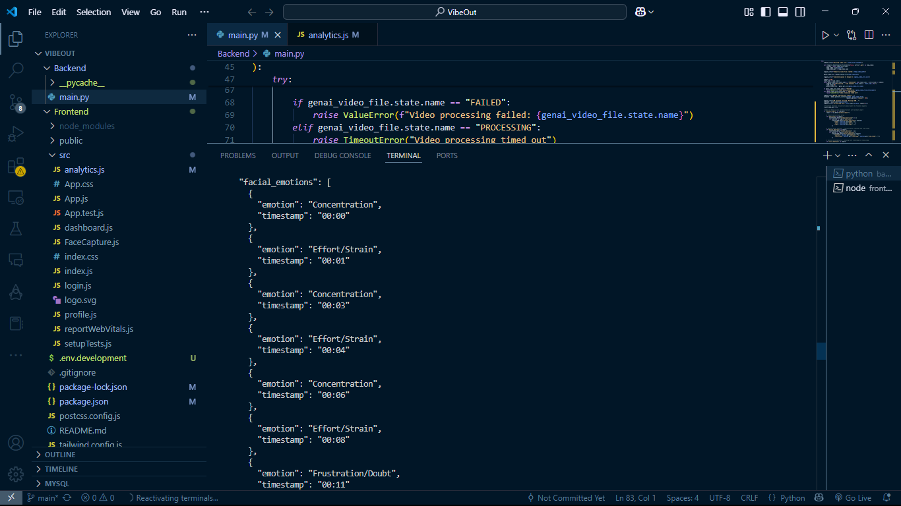
  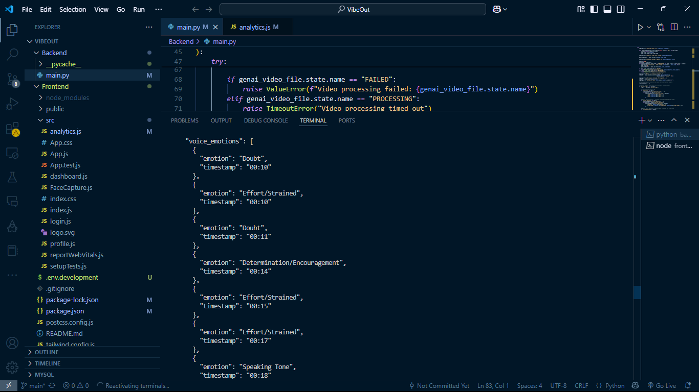
</p>

### IoT Device Setup:
1. ESP32 connected to MAX30102 sensor
2. Serial communication with backend
3. Real-time data processing with low latency
4. ThingSpeak integration for time-series analysis

### Backend Processing:
1. FastAPI server handles IoT data streams
2. Video analysis for emotion detection
3. JSON-based workout recommendations
4. Secure API endpoints for frontend communication

## 🏁 Getting Started

### Prerequisites
- Node.js & npm
- Python 3.10+
- ESP32 with MAX30102 sensor
- Arduino IDE

### Installation

```bash
# Clone repository
git clone https://github.com/madboy482/VibeOut_IoT.git

# Install backend dependencies
cd backend
pip install -r requirements.txt

# Install frontend dependencies
cd ../frontend
npm install

# Run the application
npm start
```

## 💪 Join the VibeOut Revolution

Because your workout should understand not just what you do, but how you feel.